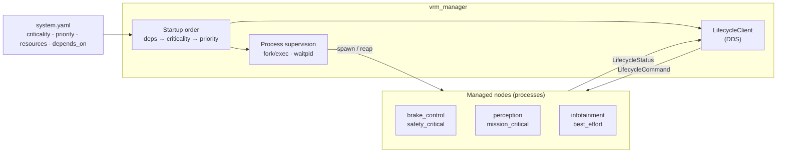
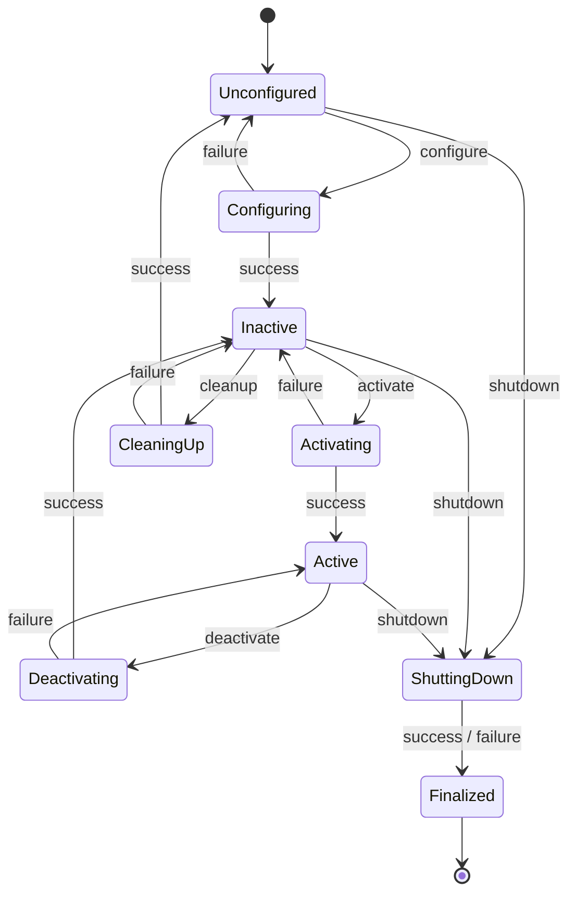
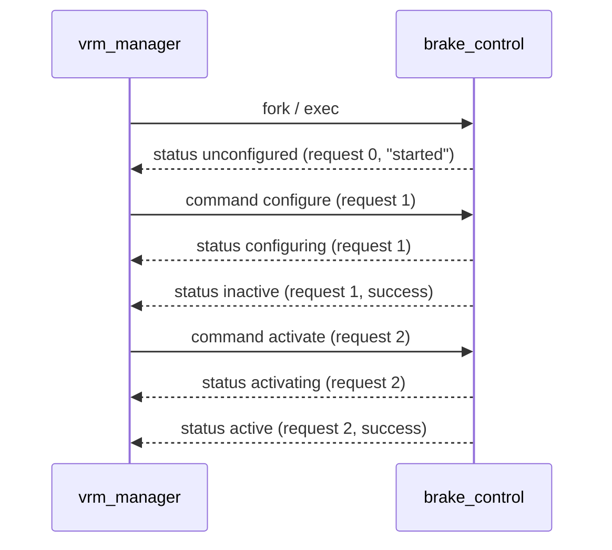
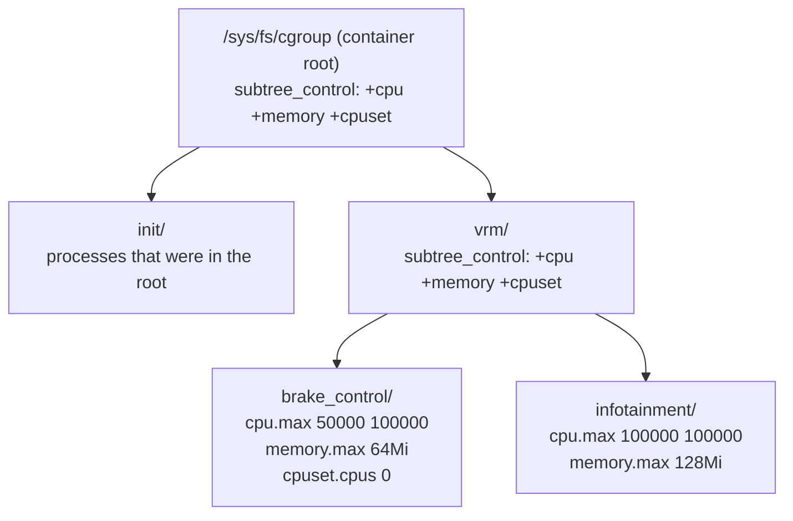

# Architecture

## 1. Overview

`vrm_manager` owns the lifecycle of every node in the system. Nodes are
separate processes that talk to the manager only through DDS; the manager
also starts them as child processes so it can supervise them.

| Component | Location | Responsibility |
|---|---|---|
| `LifecycleStateMachine` | `src/core/lifecycle.cpp` | States, transitions and callback results (no DDS) |
| Manifest | `src/core/manifest.cpp` | YAML parsing, validation, startup order |
| `ManagedNode` | `src/dds/managed_node.cpp` | Node side: receives commands, runs the state machine, publishes status |
| `LifecycleClient` | `src/manager/lifecycle_client.cpp` | Manager side: sends commands, tracks node status |
| `Manager` | `src/manager/manager.cpp` | Startup, supervision, degradation rules, shutdown |

## 2. Node Lifecycle

Based on the ROS 2 managed node design. Transition states run the matching
callback; the result decides the next primary state.

Error handling (omitted from the diagram for readability):

| Situation | Result |
|---|---|
| A callback returns `error` or throws, in any transition state | → `ErrorProcessing`, which runs `on_error` |
| `on_error` succeeds | → `Unconfigured` (the node can be configured again) |
| `on_error` fails | → `Finalized` |
| Invalid transition (e.g. `activate` while unconfigured) | Rejected; the state is unchanged |

## 3. Lifecycle Protocol over DDS

Types are defined in [`idl/LifecycleMsgs.idl`](../idl/LifecycleMsgs.idl) and
generated with `idlcxx`. Both topics are keyed by node name, so each node is
its own DDS instance.

| Topic | Type | Direction | QoS | Why |
|---|---|---|---|---|
| `vrm_lifecycle_command` | `LifecycleCommand` | manager → node | Reliable, Volatile, KeepLast 16 | Commands must not be lost, but are meaningless to a node that starts later |
| `vrm_lifecycle_status` | `LifecycleStatus` | node → manager | Reliable, TransientLocal, KeepLast 1 (writer) | A manager that (re)starts late still gets each node's current state |

**Resend and idempotency.** Because the command topic is volatile, a command
written before DDS discovery has matched the node's reader would be lost.
The manager therefore resends the command every 300 ms until the node replies
with a primary state carrying the same `request_id`. The node remembers the
last request it handled and answers duplicates by republishing its status
instead of running the transition again.

Intermediate states (`configuring`, `activating`, ...) are informational.
With a KeepLast 1 writer they may be coalesced; the manager only waits for the
primary state with the matching `request_id`.

## 4. Startup, Degradation and Shutdown

**Order.** Dependencies start first. Among nodes that are ready, the most
critical start first, then higher priority, then by name.

**Degradation rules.**

| Situation | Behaviour |
|---|---|
| Best-effort or mission-critical node fails to reach Active | Node is shut down and marked `failed`; startup continues |
| A dependency is not Active | Node is `skipped` |
| Safety-critical node fails to reach Active | Startup is aborted, all nodes are shut down, exit code 1 |
| Node process exits while Active | Logged (ERROR for safety-critical), marked `exited` |

**Shutdown** runs in reverse start order: `deactivate`, `shutdown`, wait for
the process to exit (2 s), then `SIGKILL` if needed. Nodes run in their own
process group, so Ctrl-C reaches only the manager, which then stops the nodes
in order.

## 5. Resource Isolation with cgroup v2

Each node runs in its own cgroup, so the kernel accounts and limits its CPU
and memory separately from every other node.

| Manifest | cgroup file | Effect |
|---|---|---|
| `cpu: 0.5` | `cpu.max` = `50000 100000` | At most 50 ms of CPU time per 100 ms period; then the group is throttled |
| `memory: 64Mi` | `memory.max`, `memory.swap.max = 0` | Allocations beyond the limit trigger reclaim, then the OOM killer inside this group only |
| `cpus: [0]` | `cpuset.cpus` = `0` | The node's threads may only run on CPU 0 |

**Why `init/`.** cgroup v2 does not allow a group to both contain processes
and delegate controllers to child groups ("no internal processes" rule). The
container's processes are therefore moved into `init/` before the controllers
are enabled. The manager only does this at the root of its own cgroup
namespace (a container started with `--cgroupns=private`), never in a shared
cgroup on a host.

**Joining before exec.** The manager creates the node's group first; the
child process writes its own PID to the group's `cgroup.procs` between
`fork()` and `exec()`, so the budget applies from the node's first
instruction. Because the manager is multi-threaded (DDS), that code uses only
async-signal-safe calls (no allocation, no stdio).

**Monitoring.** The manager reads each group's files:

| File | Used for |
|---|---|
| `cpu.stat` `usage_usec` | CPU usage (difference between samples) |
| `cpu.stat` `nr_throttled` | How often `cpu.max` stopped the node |
| `memory.current`, `memory.peak` | Current and peak memory |
| `memory.events` `oom_kill` | Whether an exit was an OOM kill |

When cgroups are not writable (for example an unprivileged container), the
manager logs a warning and runs without enforcement; `--require-cgroups`
turns that into an error.

## 6. Planned

Phase 3 adds SCHED_FIFO priorities and heartbeat / deadline monitoring;
phase 4 adds pressure-based arbitration (PSI), so that lower-criticality nodes
are throttled or stopped before they can interfere with safety-critical ones.
